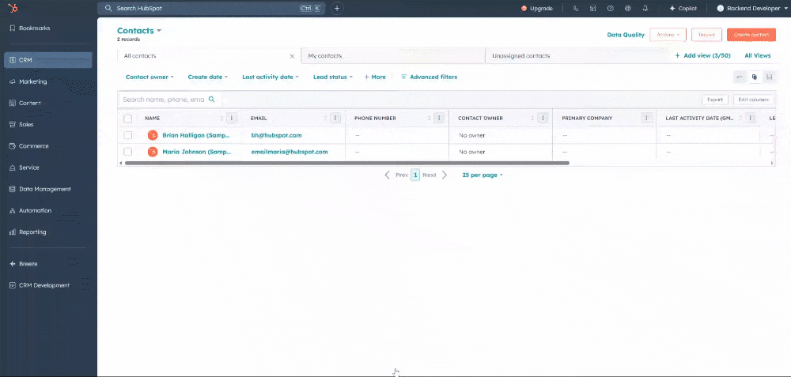

# Custom UI Card for HubSpot Contact (Modal Popup + MongoDB Data)

### System Design

- Create an express endpoints to get mongoDB data
- Run `hs project create` 
- `Join Beta` to use React JSX code for extensions
- Update necessary changes in extensions
- Run `hs project upload` 
- [Enable UI Extension in Hubspot](https://developers.hubspot.com/docs/guides/crm/private-apps/quickstart#4.-view-the-extension-in-hubspot)

### Approach

Here, I have used static endpoint where all the mongoDB data is rendered on https://hubspot-ui-card.onrender.com/ and that page will be visible on Iframe Popup on Click.

